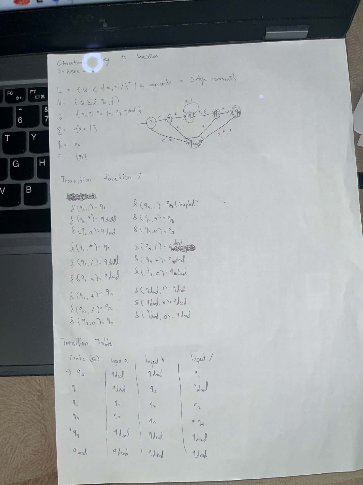

# Automata and Theory of Computation: C-Style Comment DFA

This repository contains a Deterministic Finite Automaton (DFA) implementation designed to recognize C-style block comments (`/* ... */`) over the alphabet $\Sigma = \{a, *, /\}$, where `a` acts as a placeholder for any character that is not a star or a slash.

---

## 📌 Automata Design

### States
* **$q_0$**: Initial state (waiting for the opening `/`).
* **$q_1$**: Read opening `/`, waiting for `*`.
* **$q_2$**: Inside the comment body (last read symbol was not `*`).
* **$q_3$**: Inside the comment body, last read symbol was `*` (potential closing).
* **$q_4$**: **Accepting state** (comment successfully closed with `*/`).
* **$q_{\text{dead}}$**: Dead/Trap state (invalid sequence or extra characters after closing).

### Transition Table

| State | Input `a` | Input `*` | Input `/` |
| :--- | :--- | :--- | :--- |
| $\rightarrow q_0$ | $q_{\text{dead}}$ | $q_{\text{dead}}$ | $q_1$ |
| $q_1$ | $q_{\text{dead}}$ | $q_2$ | $q_{\text{dead}}$ |
| $q_2$ | $q_2$ | $q_3$ | $q_2$ |
| $q_3$ | $q_2$ | $q_3$ | $*q_4$ |
| $*q_4$ | $q_{\text{dead}}$ | $q_{\text{dead}}$ | $q_{\text{dead}}$ |
| $q_{\text{dead}}$ | $q_{\text{dead}}$ | $q_{\text{dead}}$ | $q_{\text{dead}}$ |

---

## 📝 Written Assignment

Here is the handwritten formal definition, transition table, and transition graph:



---

## 💻 Program Output

Running the C++ program validates the test cases exactly as required:

```text
========================================
   C-STYLE COMMENT DFA VALIDATOR        
========================================

--- ACCEPTED STRINGS ---
/*a*/           -> Accepted
/**/            -> Accepted
/***/           -> Accepted
/*aaa*aaa*/     -> Accepted
/*a/a*/         -> Accepted

--- REJECTED STRINGS ---
/**             -> Rejected
/**/a/*aa*/     -> Rejected
aaa/**/aa       -> Rejected
/*/             -> Rejected
/**a/           -> Rejected
//aaaa          -> Rejected
========================================