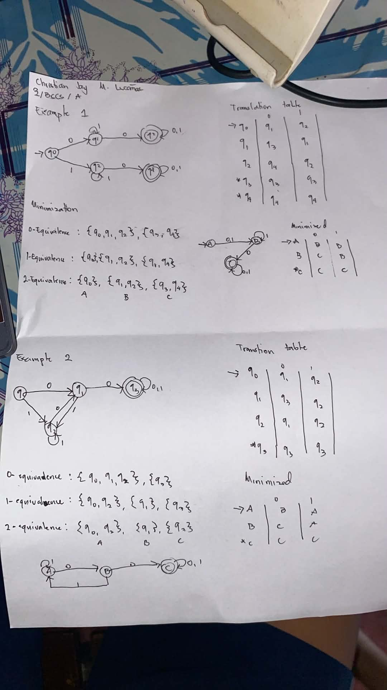

# Automata and Theory of Computation Assignments

This repository contains coding implementations and handwritten solutions for Deterministic Finite Automaton (DFA) activities.

---

## 🔬 Lab 1: C-Style Comment DFA

This section contains a DFA implementation designed to recognize C-style block comments (`/* ... */`) over the alphabet $\Sigma = \{a, *, /\}$, where `a` acts as a placeholder for any character that is not a star or a slash.

### 📌 Automata Design

#### States
* **$q_0$**: Initial state (waiting for the opening `/`).
* **$q_1$**: Read opening `/`, waiting for `*`.
* **$q_2$**: Inside the comment body (last read symbol was not `*`).
* **$q_3$**: Inside the comment body, last read symbol was `*` (potential closing).
* **$q_4$**: **Accepting state** (comment successfully closed with `*/`).
* **$q_{\text{dead}}$**: Dead/Trap state (invalid sequence or extra characters after closing).

#### Transition Table

| State | Input `a` | Input `*` | Input `/` |
| :--- | :--- | :--- | :--- |
| $\rightarrow q_0$ | $q_{\text{dead}}$ | $q_{\text{dead}}$ | $q_1$ |
| $q_1$ | $q_{\text{dead}}$ | $q_2$ | $q_{\text{dead}}$ |
| $q_2$ | $q_2$ | $q_3$ | $q_2$ |
| $q_3$ | $q_2$ | $q_3$ | $*q_4$ |
| $*q_4$ | $q_{\text{dead}}$ | $q_{\text{dead}}$ | $q_{\text{dead}}$ |
| $q_{\text{dead}}$ | $q_{\text{dead}}$ | $q_{\text{dead}}$ | $q_{\text{dead}}$ |

### 📝 Written Assignment

Here is the handwritten formal definition, transition table, and transition graph:

---

## 🔬 Lab 2: Minimization of DFA

This section contains four DFA minimization exercises. The first two are based on classroom examples, and the remaining two are completely original custom designs. Each includes a step-by-step minimization solution, a transition table, and a C++ validation program.

### 📌 Minimized Transition Tables

**1. Class Example 1 (Minimized to 3 States)**
| State | Input `0` | Input `1` |
| :--- | :--- | :--- |
| $\rightarrow AB$ | $AB$ | $CDE$ |
| $*CDE$ | $CDE$ | $F$ |
| $F$ (Trap) | $F$ | $F$ |

**2. Class Example 2 (Minimized to 4 States)**
| State | Input `0` | Input `1` |
| :--- | :--- | :--- |
| $\rightarrow AC$ | $B$ | $AC$ |
| $B$ | $B$ | $D$ |
| $D$ | $B$ | $E$ |
| $*E$ | $B$ | $AC$ |

**3. Custom Example 1 (Accepts string containing '0' after 1st char)**
| State | Input `0` | Input `1` |
| :--- | :--- | :--- |
| $\rightarrow A$ | $B$ | $B$ |
| $B$ | $C$ | $B$ |
| $*C$ | $C$ | $C$ |

**4. Custom Example 2 (Accepts string containing '00')**
| State | Input `0` | Input `1` |
| :--- | :--- | :--- |
| $\rightarrow A$ | $B$ | $A$ |
| $B$ | $C$ | $A$ |
| $*C$ | $C$ | $C$ |

### 📝 Written Assignments

Here are the handwritten step-by-step equivalence groupings and transition graphs for the four minimization examples:

*(Replace the link below with the actual image of your Lab 2 written solutions)*

### 💻 Program Implementations

The C++ implementations for the minimized DFAs are split into four source files:
* `minimized_dfa1.cpp` - Validates Class Example 1
* `minimized_dfa2.cpp` - Validates Class Example 2
* `custom_minimized1.cpp` - Validates Custom Example 1
* `custom_minimized2.cpp` - Validates Custom Example 2